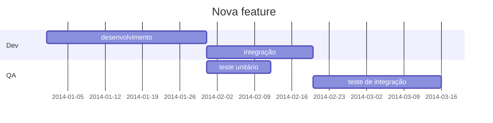
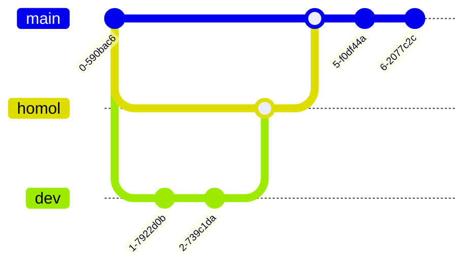

# Documentação com Markdown

## Índice

- [Descrição](#descrição)
- [Tecnologias](#tecnologias)
- [Deploy](#deploy)
- [Especificações](#especificações)
- [Git](#git)

## Descrição

> O arquivo `README.md` principal pode conter uma descrição mais geral do projeto inteiro contendo items como: especificações, organização do repositório e onde encontrar outras informações importantes.

O projeto foi desenvolvido com o objetivo de exemplificar a documentação de um projeto

### Schedule



## Tecnologias

- Terraform X.X.X
- Terragrunt X.X.X

## Deploy

Subir a aplicação:

```sh
terragrunt apply
```

## Especificações

> Em subdiretórios é possível fazer uma especificação mais técnica de cada parte do projeto como a documentação do código do projeto, especificações do banco de dados, jornada do usuário, etc...

O projeto contava com s

Exemplo de documentação de cada parte do projeto:

- [backend](./backend)
- [database](./database)
- [frontend](./frontend)
- [IA](./ia)

## Git

> É possível exemplificar o funcionamento das branches

- `main`: Ambiente de produção
- `homol`: Ambiente de homologação
- `dev`: Ambiente de desenvolvimento


