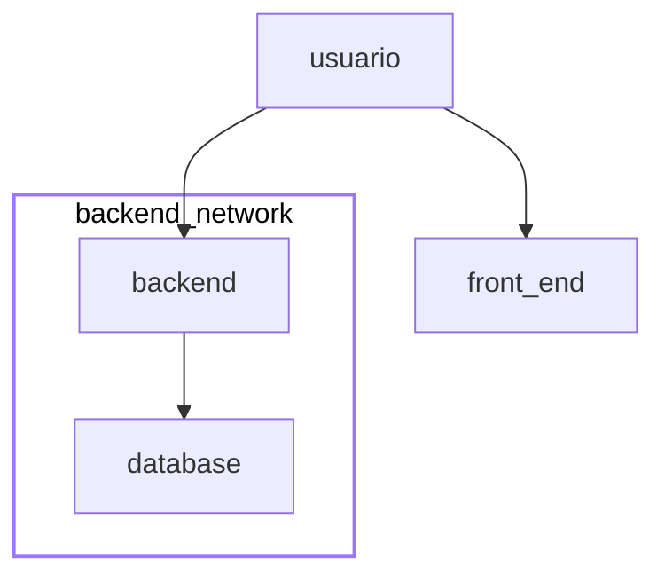
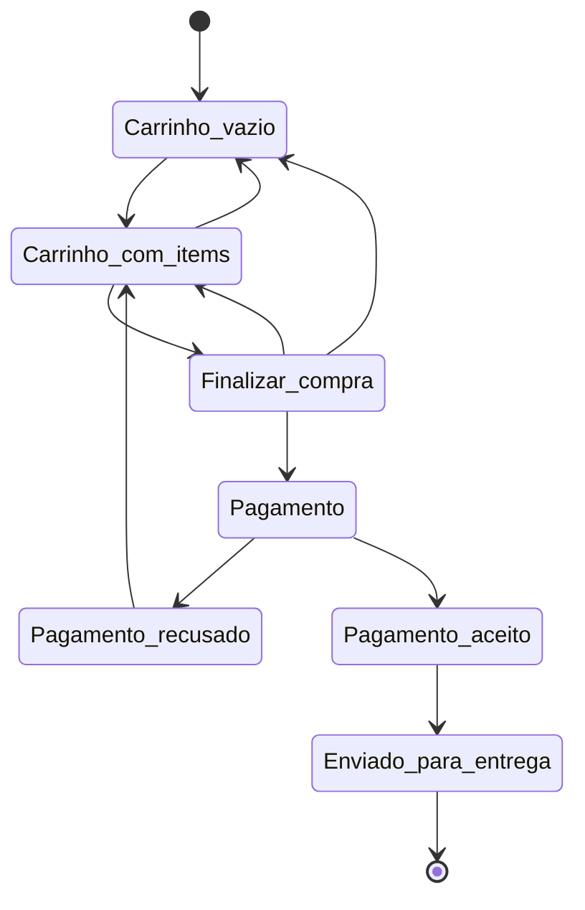

# Documentação com Markdown

O arquivo `README.md` principal pode conter uma descrição mais geral do projeto inteiro contendo items como: especificações, organização do repositório e onde encontrar outras informações importantes.

Em subdiretórios é possível fazer uma especificação mais técnica de cada parte do projeto como a documentação do código do projeto, especificações do banco de dados, jornada do usuário, etc...

Exemplo de documentação de cada parte do projeto:

- [backend](./backend)
- [fronend](./frontend)
- [database](./database)
- [IA](./ia)

## Mermaid (Sem suporte para celular)

Para criar os seus flowcharts é possível usar o [editor online](https://mermaid.live/)

Exemplos de representação de infraestrutura usando `mermaid`

Diagrama de estados

