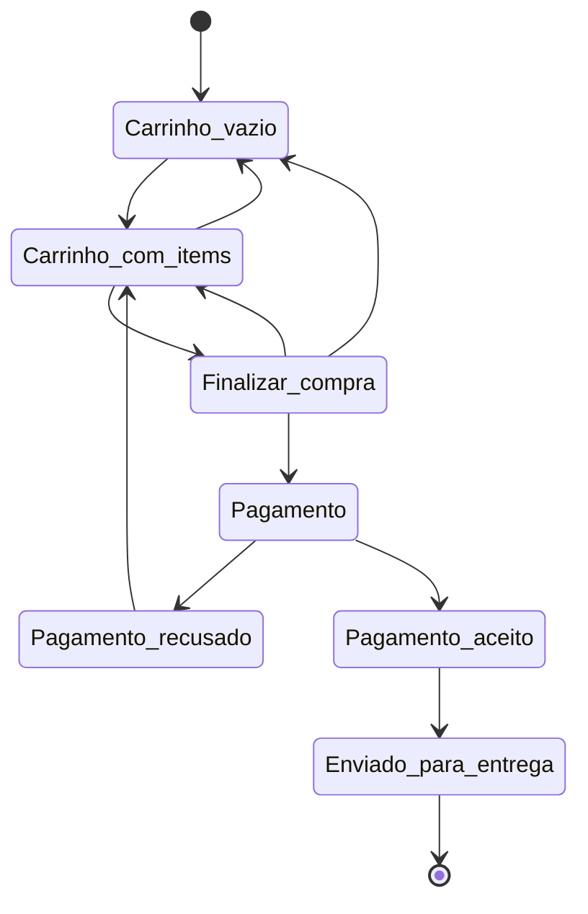
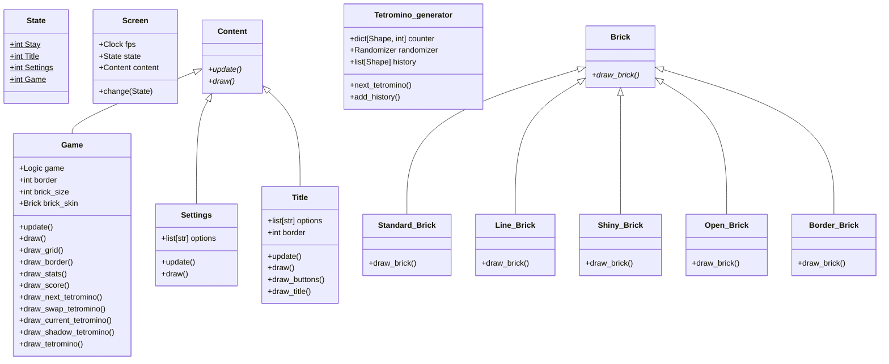

# Especificações do backend

## Índice

- [Especificações](#especificações)
    - [Responsáveis](#responsáveis)
    - [Tecnologias](#tecnologias)
    - [Deploy](#deploy)
    - [Variáveis de Ambiente](#variáveis-de-ambiente)
    - [Arquivos](#arquivos)
- [Sistema](#sistema)
- [Deploy](#deploy)
- [Código](#código)
- [Classe UML](#classe-uml)
- [Documentação API](#documentação-api)

## Especificações

A aplicação vai estar disponível na porta `8080`

### Responsáveis

> Facilita para encontrar quem foi o responsável por desenvolver esse sistema

- Mariana
- Rhavilla
- Tsuyoshi

### Tecnologias

> Documentar a versão de todas as tecnologias que estão sendo utilizadas no projeto para evitar erros

- Java 21.0.1
- Maven 3.9.6
- JUnit X.X.X
- Docker X.X.X

### Deploy

```sh
docker-compose up
```

### Variáveis de ambiente

> Facilitar a configuração do sistema utilizando variáveis de ambiente

- `UVICORN_PORT`: 8000
- `UVICORN_HOST`: 0.0.0.0
- `UVICORN_WORKERS`: 1

### Arquivos

> Explicação dos arquivos existentes no diretório

- `backend.Dockerfile`: Imagem do container
- `*`: Código da aplicação

## Sistema

> Para o desenvolvedor ter um entendimento melhor sobre o funcionamento do sistema pode ser utilizado um diagrama de estados
>
> Para criar os seus flowcharts é possível usar o [editor online](https://mermaid.live/)

Diagrama de estados



## Deploy

> É importante colocar instruções sobre o ambiente que a aplicação foi testada e como é possível subir a aplicação.

Especificações para rodar o ambiente:

- Mínimo de X GB de memória RAM
- Mínimo de Y VCPU

> Caso a aplicação tenha dependências é necessário especificar as dependências também.

Dependências:

- Necessário subir o [banco de dados](../database)

> Colocar exemplos de como executar o ambiente especificado

Exemplo de `shellscript`:

```sh
# Buildar os containers
COMPOSE_DOCKER_CLI_BUILD=1 DOCKER_BUILDKIT=1 docker-compose build

# Rodar os containers
COMPOSE_PROJECT_NAME=projeto docker-compose up
```

A aplicação vai estar rodando na porta `8080`

## Código

Caso seja necessário é possível exemplificar e mostrar partes específicas do código:

```cpp
#include<iostream>

int main() {
    std::cout << "exemplo" << std::endl;
    return 0;
}
```

## Classe UML

Para ter um entendimento melhor dos arquivos e as classes que foram desenvolvidas no projeto é possível criar flowcharts usando mermaid.

Dessa forma é possível ter uma visão geral das classes principais e das funções disponíveis em cada classe.

Exemplo de documentação de código UML:



## Documentação API

> Caso a aplicação tenha uma documentação gerada automaticamente é importante colocar o link também

A documentação da aplicação pode ser encontrada em `/docs`

> É sempre importante documentar os endpoints da aplicação e documentar como usar cada endpoint

Requisições implementadas na aplicação

- `/api/usuario/listar`
    - Requisição: `GET`
    - Descrição: Fornecer uma lista com os usuários em formato JSON
    - Exemplo:
    ```sh
    curl localhost:8080/api/usuario/listar
    ```
    - Resposta correta `200 OK`:
    ```json
  [
    {
        "id": 1,
        "email": "abigail@gg.com",
        "nome": "Abigail",
        "senha": "0800fc577294c34e0b28ad2839435945",
    },
    {
        "id": 2,
        "email": "roro@gg.com",
        "nome": "Robert",
        "senha": "912ec803b2ce49e4a541068d495ab570",
    }
  ]
    ```

- `/api/usuario/add`
    - Requisição: `POST`
    - Descrição: Inserir um usuário novo
    - Exemplo:
    ```sh
    curl -X POST -d '{ "email": "teste@email.com", "nome": "nome", "senha": "pass"}' localhost:8080/api/usuario/add
    ```
    - Resposta correta `200 OK`:
    ```json
  [
    {
        "id": 3,
        "email": "teste@email.com",
        "nome": "nome",
        "senha": "1a1dc91c907325c69271ddf0c944bc72",
    }
  ]
    ```

