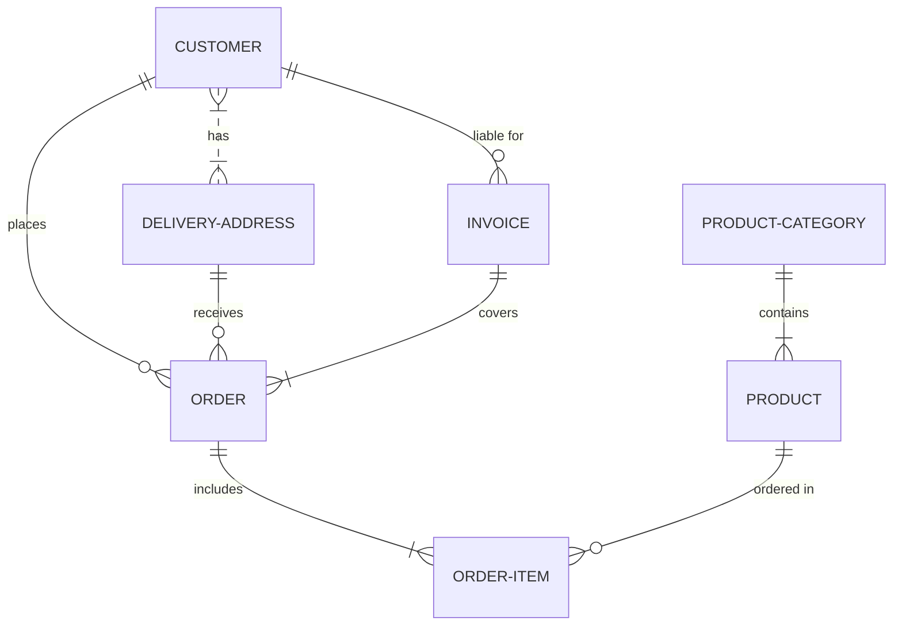

# Especificações do banco de dados

## Índice

- [Tecnologias](#tecnologias)
- [Sistema](#sistema)
- [Deploy](#deploy)
- [Tabelas](#tabelas)

## Tecnologias

- PostgreSQL X.X.X

## Deploy

```sh
terraform apply -f .
```

## Tabelas

> No banco de dados é possível especificar as relações das entidades


