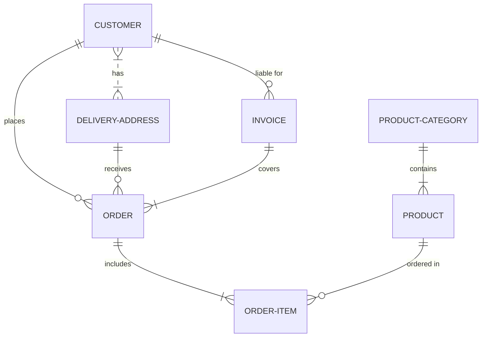

# Especificações do banco de dados

## Índice

- [Especificações](#especificações)
    - [Responsáveis](#responsáveis)
    - [Tecnologias](#tecnologias)
    - [Deploy](#deploy)
    - [Variáveis de Ambiente](#variáveis-de-ambiente)
    - [Arquivos](#arquivos)
- [Tabelas](#tabelas)

## Especificações

A aplicação vai estar disponível na porta `3389`

### Responsáveis

- Mariana
- Rhavilla
- Tsuyoshi

### Tecnologias

- PostgreSQL X.X.X

### Deploy

```sh
terraform apply -f .
```

### Variáveis de ambiente

- `POSTGRES_DB_FILE`: ${POSTGRES\_DB\_FILE:?err}
- `POSTGRES_USER_FILE`: ${POSTGRES\_USER\_FILE:?err}
- `POSTGRES_PASSWORD_FILE`: ${POSTGRES\_PASSWORD\_FILE:?err}

### Arquivos

- `script.sh`: Script de inicialização do banco de dados

## Tabelas

> No banco de dados é possível especificar as relações das entidades


