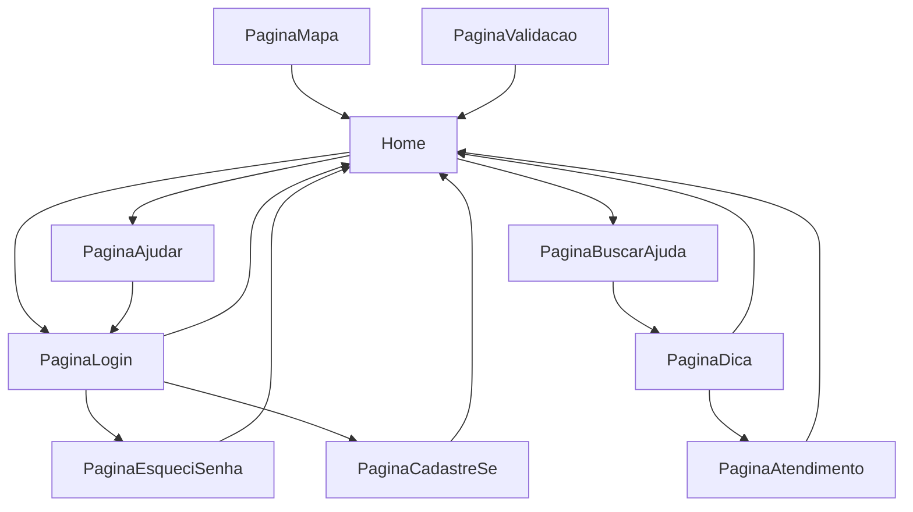

# Especificações do frontend

## Índice

- [Especificações](#especificações)
    - [Responsáveis](#responsáveis)
    - [Tecnologias](#tecnologias)
    - [Deploy](#deploy)
    - [Variáveis de Ambiente](#variáveis-de-ambiente)
    - [Arquivos](#arquivos)
- [Jornada do usuário](#jornada-do-usuário)

## Especificações

A aplicação vai estar disponível na porta `8888`

### Responsáveis

- Mariana
- Rhavilla
- Tsuyoshi

### Tecnologias

- node X.X.X
- npm X.X.X
- typescript X.X.X
- nginx X.X.X

### Deploy

```sh
npm run export
```

### Variáveis de ambiente

- `NODE_ENV`: `production` ou `development`
- `NODE_CONFIG_LOGLEVEL`: `debug`

### Arquivos

- `.nginx`: Configuração do nginx
- `frontend.Dockerfile`: Imagem do container
- `*`: Código da aplicação

## Telas

[Link](https://www.figma.com) para o figma

## Jornada do usuário


